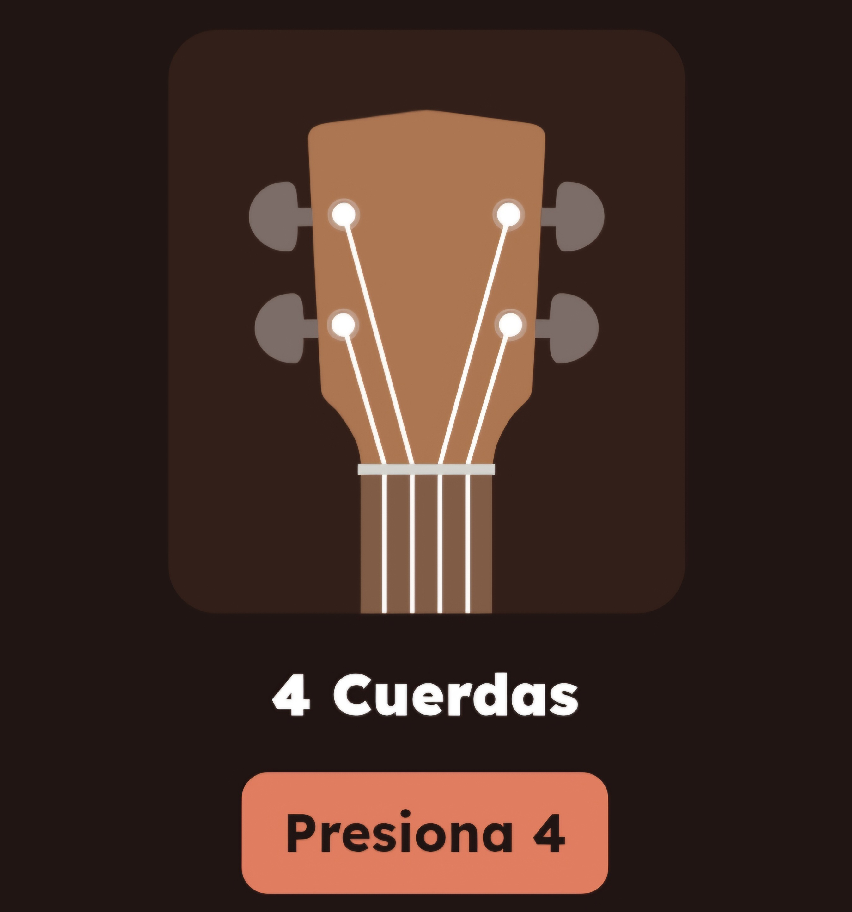
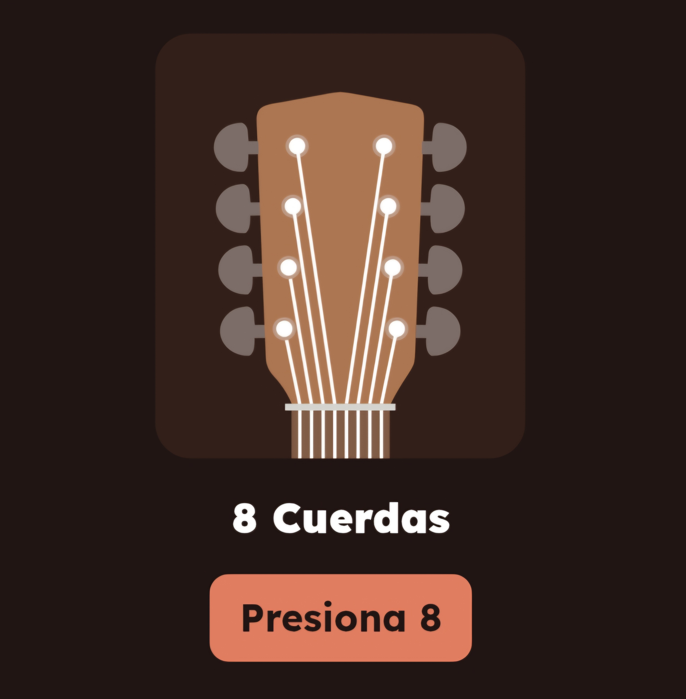
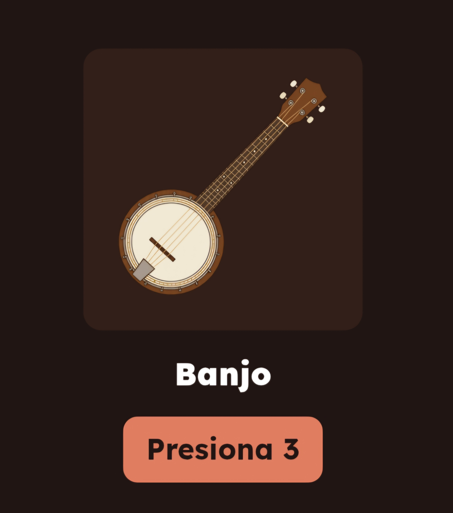
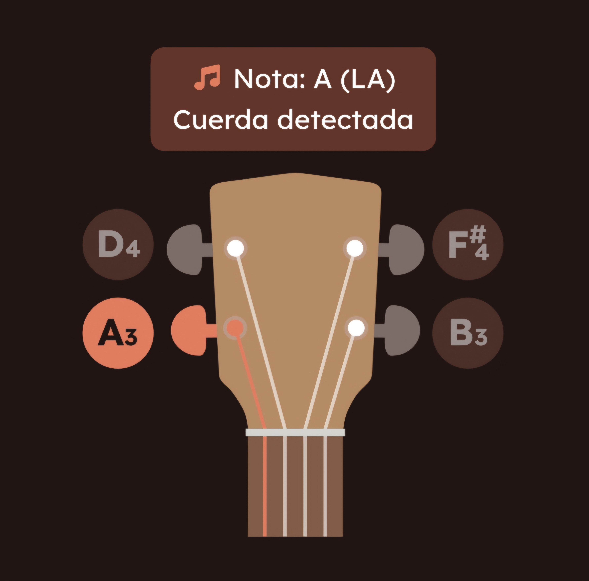
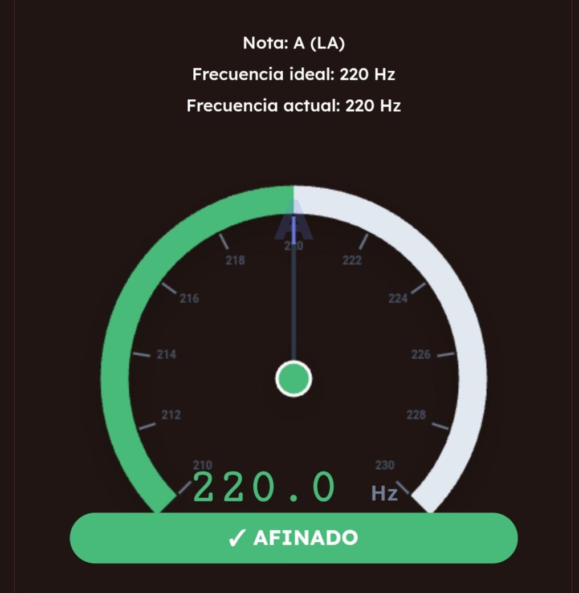

# Afinador de Cuerdas Automático

<p align="center">
<b>1. Pantalla de Inicio</b><br>
</p>  

<p align="center">

</p>

<p align="center">
  Esta es la puerta de entrada a la aplicación. Su propósito es ofrecer una interfaz limpia y minimalista
  que permita al usuario prepararse antes de comenzar el proceso de afinación, asegurando una experiencia libre de distracciones.<br>
  <i></i><br><br>
</p>

<p align="center">
<b>2. Menú </b><br>
</p>  

<p align="center">

</p>

<p align="center">
Esta sección permite al usuario gestionar su flujo de trabajo, facilitando el cambio entre diferentes instrumentos o la limpieza de la sesión actual.<br>
  <i></i><br><br>
</p>

<p align="center">
<b>3. Selección por Número de Cuerdas </b><br>
</p>  

<p align="center">
En esta etapa, el usuario define la complejidad del instrumento que desea afinar. La aplicación categoriza los instrumentos según su número de cuerdas para optimizar el algoritmo de detección de frecuencia.<br>
  <i></i><br><br>
</p>

<p align="center">

</p>

<p align="center">

</p>

<p align="center">

</p>

<p align="center">
<b>4. Selección de Instrumento Específico </b><br>
</p>  

<p align="center">
Una vez definida la categoría por número de cuerdas, la aplicación filtra y despliega los instrumentos compatibles. Este paso es crucial para cargar las frecuencias exactas y el orden de las notas que el algoritmo debe reconocer.<br>
  <i></i><br><br>
</p>

<p align="center">
<b>4.1. Catálogo de Instrumentos: 4 Cuerdas </b><br>
</p>  

<p align="center">
Una vez definida la categoría por número de cuerdas, la aplicación filtra y despliega los instrumentos compatibles. Este paso es crucial para cargar las frecuencias exactas y el orden de las notas que el algoritmo debe reconocer.<br>
  <i></i><br><br>
</p>

<p align="center">

</p>

<p align="center">

</p>

<p align="center">

</p>

<p align="center">
<b>4.2. Catálogo de Instrumentos: 6 Cuerdas </b><br>
</p>  


<p align="center">
Futuro desarrollo...<br>
  <i></i><br><br>
</p>


<p align="center">
<b>4.2. Catálogo de Instrumentos: 8 Cuerdas </b><br>
</p>  

<p align="center">
Futuro desarrollo...<br>
  <i></i><br><br>
</p>

<p align="center">
<b>5. Interfaz de Afinación: Cuatro Venezolano</b><br>
</p>  

<p align="center">
Una vez seleccionado el instrumento, la aplicación entra en modo de escucha activa. Esta pantalla está diseñada para procesar la señal de audio y compararla con las frecuencias estándar del Cuatro (afinación tradicional: La, Re, Fa#, Si).<br>
  <i></i><br><br>
</p>

<p align="center">
<b> Notas </b><br>
</p>  

<p align="center">

</p>

<p align="center">
En esta pantalla, el sistema procesa la señal de audio capturada y ofrece una respuesta visual inmediata sobre la cuerda que se está ejecutando.<br>
  <i></i><br><br>
</p>

<p align="center">
<b> Frecuencias </b><br>
</p>  

<p align="center">

</p>

<p align="center">
Esta pantalla proporciona al usuario una referencia visual de alta precisión (estilo velocímetro) para lograr la afinación exacta.<br>
  <i></i><br><br>
</p>

<p align="center">
<b>5. Interfaz de Afinación: Banjo</b><br>
</p>  

<p align="center">
Futuro desarrollo...<br>
  <i></i><br><br>
</p>

<p align="center">
<b>5. Interfaz de Afinación: Ukelele</b><br>
</p>  

<p align="center">
Futuro desarrollo...<br>
  <i></i><br><br>
</p>

# Prerequisitos

```
Node.js >= v20.20.0
npm
Python 3.12.X
FastAPI
```

<h3>Configuración del Backend (FastAPI)</h3>

Crear un entorno virtual con Python 3:

```
$ sudo apt install python3-venv
```

Crear el entorno virtual:

```
$ python3 -m venv FastAPI
```

Activar el entorno virtual:

```
$ source FastAPI/bin/activate
```

Instalación de fastapi dentro del entorno virtual:

```
(FastAPI) $ pip install "fastapi[standard]"
```

Abre una nueva terminal y navega al directorio del afinador_app/FastAPI:

```
$ cd FastAPI
```

Ejecuta el servidor de FastAPI:

```
$ fastapi dev main.py
```

Prueba tu API, Una vez que el servidor esté corriendo, puedes ver los resultados
en http://127.0.0.1:8000. Verás el JSON.

<h3>Configuración del Frontend (Nuxt)</h3>

Abre una nueva terminal y navega al directorio del afinador_app:

```
$ cd afinador_app
```

Instala las dependencias de Node.js:

```
$ npm install
```

Crea tu archivo de configuración local:

```
$ cp .env_example .env
```

Inicia el servidor de desarrollo de Nuxt:

```
$ npm run dev
```

La aplicación Nuxt estará disponible en http://localhost:3000/

Notas de desarrollo

Órdenes del backend para navegar en la app:

```
-1 Nivel se espera: 1,0
-2 Nivel se espera: 4,6,8,0
-3 Nivel se espera: 41,42,43,0
```

El json que se va a recibir del API será:

{
  "data":{
    "order":1,
    "frequency":210.0,
    "note":"A"
  }
}

Las notas que se van a recibir son:
- Nota A (LA)
- Nota D (RE)
- Nota F = F# (Fa#)
- Nota B (Si)

# Afinador-mobile
Aplicación desarrollada con nuxt.js, para dispositivos móviles usando android studios

Transformar el sistema del afinador en una aplicación móvil nativa para Android utilizando Capacitor

**Instala el núcleo y la CLI:**

```
npm install @capacitor/core @capacitor/cli @capacitor/android
```

**Inicializa Capacitor**

```
npx cap init
```

- **App name:** Nombre de la aplicación.
- **App ID:** Identificador único (ej: com.tuempresa.app).
- **Web asset directory:** Aquí es crucial poner la carpeta de salida del npm run generate (usualmente dist o .output/public).

**Generamos la carpeta de exportacion para que Capacitor sepa qué copiar**

```
npm run generate
```

**Agregar la plataforma Android**

```
npx cap add android
```

Esto crea una carpeta llamada /android en la raíz del proyecto.
Esta carpeta contiene el código nativo.

**Configurar el .gitignore**

Asegúrate de que tu .gitignore permita subir la carpeta /android, pero que ignore los archivos temporales de Gradle. Normalmente, el comando cap add ya crea un .gitignore dentro de la carpeta /android, así que no deberías tener problemas.

**Subir al repositorio**

```
git add .
git commit -m "Agregados Capacitor y la carpeta Android"
git push origin main
```

##Ahora desde android studios

**Instalar dependencias y sincronizar:**

```
npm install
npx cap sync
```

(Este comando es clave: actualiza los plugins y copia la última versión de la carpeta web a la carpeta de Android)


**Abrir el proyecto:**

Se puede abrir Android Studio y seleccionar la carpeta /android del proyecto, o simplemente ejecutar:

```
npx cap open android
```

**Generar el APK o ejecutar en emulador:**

- En Android Studio, debe ir a Build > Build Bundle(s) / APK(s) > Build APK(s).
- O simplemente darle al botón de Run para probarlo en su celular o emulador.

**Importante:**

Cada vez que se haga un cambio en el diseño/lógica de Nuxt: Debes hacer npm run generate y luego npx cap copy antes de subir al repo.

En caso de que se instale un plugin nuevo: Deben correr npm install [nombre-del-plugin] y luego npx cap sync.

Directorio de salida: Si notas que al abrir la app en Android sale una pantalla blanca, verifica que en el archivo capacitor.config.json el campo webDir coincida exactamente con la carpeta que genera Nuxt (ej: "webDir": "dist").

**Error con la direccion: http://127.0.0.1:8000/api**

Cuando corres Nuxt en tu navegador, 127.0.0.1 apunta a tu computadora. Pero cuando la app está dentro de un celular (o un emulador), 127.0.0.1 apunta al propio celular. Como el servidor FastAPI no está corriendo dentro del teléfono, la conexión falla.

**Cambiar la IP en el archivo .env:**

Debes usar la dirección IP local de la computadora donde está corriendo el servidor FastAPI.

En la computadora que corre FastAPI, abre la terminal y busca su IP:

- Windows: ipconfig (busca "Dirección IPv4", suele ser algo como 192.168.1.XX).
- Linux/Mac: ifconfig o ip a.

Actualiza tu .env de Nuxt:

```
# Reemplaza con la IP real de tu PC
NUXT_PUBLIC_API_BASE=http://192.168.1.15:8000/api
```
**Configurar FastAPI para aceptar conexiones externas**
Por defecto, muchos servidores locales solo escuchan peticiones de la misma máquina. Debes forzar a FastAPI a escuchar en todas las interfaces de red de tu PC:

Modifica el comando con el que arrancas FastAPI:
```
# El host 0.0.0.0 permite que otros dispositivos de la red se conecten
fastapi dev main.py --host 0.0.0.0 --port 8000
```

**Conectar los dispositivos a la misma red:**
Para que esto funcione sin subir el API a internet (despliegue real):

El teléfono físico y la computadora deben estar conectados a la misma red Wi-Fi.

Si usas el emulador de Android Studio, la IP 192.168.1.XX debería funcionar, pero Android tiene una IP especial para referirse a la máquina host: 10.0.2.2. Sin embargo, usar la IP real de tu Wi-Fi es lo más confiable para ambos casos.

**Configurar el "Cleartext" (Permisos de Android)**

Android, por seguridad, bloquea por defecto las conexiones http (sin S). Como tu API local es http://, debes darle permiso explícito a la app:

1. Ve a la carpeta de Android en tu proyecto: android/app/src/main/AndroidManifest.xml.
2. Busca la etiqueta <application> y añade el atributo android:usesCleartextTraffic="true":

```
<application
    android:allowBackup="true"
    android:icon="@mipmap/ic_launcher"
    android:label="@string/app_name"
    android:roundIcon="@mipmap/ic_launcher_round"
    android:supportsRtl="true"
    android:theme="@style/AppTheme"
    android:usesCleartextTraffic="true"> ...
</application>
```

**Actualizar el APK:**
Cada vez que cambies el .env, debes repetir el proceso para que los cambios se reflejen en la carpeta de Android:

- npm run generate (para compilar Nuxt con la nueva IP).
- npx cap copy (para pasar los archivos nuevos a la carpeta android).
- En Android Studio, vuelve a generar el APK o dale a Run.
